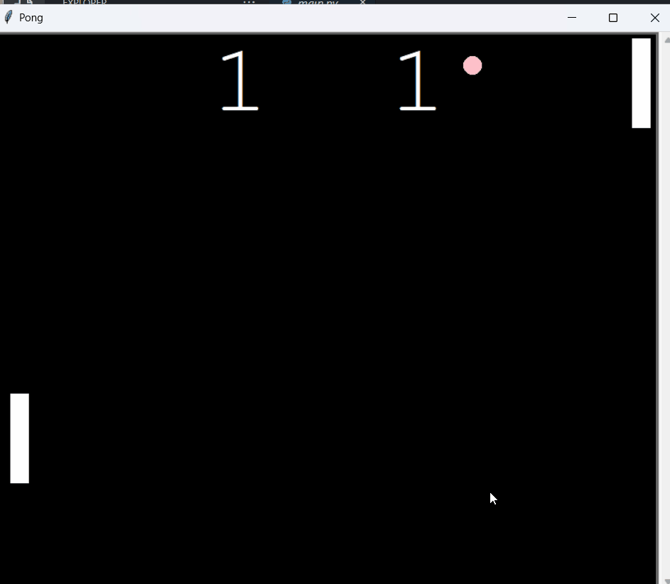

# Pong Game

## Pong Game built in Python with the Turtle library

<br>

> ### About the Game
>
> - Player 1 controls the paddle with the "w" and "s" keys
> - Player 2 controls the paddle with the "up" and "down" keys

<br><br><br><br><br><br><br>



<br><br><br>

## Setup

1. Clone this repository.
2. Run the following command in the terminal.

```sh
python main.py
```
